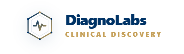

# 🧬 DiagnoLabs — India's Advanced Medical Diagnostics Platform

<div align="center">



[](https://react.dev/)
[](https://nodejs.org/)
[](https://mongodb.com/)

**Discover NABL-certified laboratories · Book diagnostic tests · Track results — all in one platform.**

[Live Demo](#) · [Report Bug](../../issues) · [Request Feature](../../issues)

</div>

---

## 📋 Table of Contents

- [About the Project](#-about-the-project)
- [Features](#-features)
- [Tech Stack](#-tech-stack)
- [Project Structure](#-project-structure)
- [Getting Started](#-getting-started)
- [Environment Variables](#-environment-variables)
- [API Reference](#-api-reference)
- [User Roles](#-user-roles)
- [Screenshots](#-screenshots)
- [Contributing](#-contributing)
- [License](#-license)

---

## 🏥 About the Project

**DiagnoLabs** is a full-stack, production-grade healthcare diagnostics platform built for India. It connects patients with NABL-certified laboratories, enables real-time test booking, AI-assisted health guidance, and provides a complete staff management suite for lab operators.

> Built with a mobile-first philosophy — every screen is fully responsive across all devices.

### Why DiagnoLabs?

- 🗺️ **Spatial Lab Discovery** — Maps labs across India using OpenStreetMap & Pincode Registry
- 🤖 **Clinical AI Chatbot** — Powered by Google Gemini for intelligent health guidance
- 📅 **End-to-End Booking** — Appointment scheduling, payment via Razorpay, PDF reports
- 🔐 **Role-Based Access Control** — 14 distinct staff roles with secure JWT authentication
- 📊 **Admin Command Center** — Full visibility into bookings, labs, staff, and financials

---

## ✨ Features

### 👤 Patient Portal
- 🔍 **Smart Lab Search** — Search by test name, lab, city, or specialty
- 📍 **Nearby Lab Finder** — GPS-based proximity detection with distance & ETA
- 🏷️ **NABL Badge Verification** — Community vs Verified lab classification
- 📅 **Appointment Booking** — Home collection or walk-in scheduling
- 💳 **Razorpay Payment Gateway** — Secure online payments with receipt generation
- 📄 **PDF Report Downloads** — Digitally generated test reports
- 📱 **OTP Verification** — Twilio SMS + email OTP for account security
- 🔐 **Google OAuth 2.0** — One-click social login
- 📖 **Booking History** — Full history with status tracking

### 🧬 Lab & Admin Dashboard
- 📊 **Real-Time Analytics** — Booking stats, revenue charts, test performance
- 🏢 **Lab Partner Management** — Onboard/manage partner labs
- 👨‍💼 **Staff Provisioning** — Create accounts for 14 role types with auto-generated Employee IDs
- 🎟️ **Promo Code Engine** — Create discount codes with usage limits
- 📦 **Inventory Management** — Track consumables and reagents
- 🎫 **Support Ticket System** — Internal helpdesk for patient queries
- 📋 **Audit Logs** — Full action history for compliance
- 🗺️ **India Labs Network Map** — Geographic visualization of all partner labs

### 🤖 Clinical AI Assistant
- 💬 **Conversational Health Guidance** — Powered by Google Gemini AI
- 🔊 **Text-to-Speech** — Voice output for accessibility
- ⚡ **Quick Prompts** — One-tap common health queries
- 📎 **File Attachment Support** — Upload reports for analysis
- 🧪 **Test Recommendations** — Context-aware diagnostic suggestions

### 🚚 Sample Collector Dashboard
- 📱 **Mobile-Optimized** — Built for field phlebotomists
- 📷 **Barcode Scanner** — QR/barcode sample tracking
- 🗺️ **Route Optimization** — Daily collection route management
- ✅ **Sample Status Updates** — Real-time status push to patients

---

## 🛠️ Tech Stack

### Frontend
| Technology | Purpose |
|---|---|
| **React 18** | UI framework |
| **Vite** | Build tool & dev server |
| **Framer Motion** | Animations & transitions |
| **Lucide React** | Icon system |
| **Axios** | HTTP client |
| **React Router v6** | Client-side routing |
| **@react-oauth/google** | Google OAuth |
| **Vanilla CSS + clamp()** | Mobile-first responsive design |

### Backend
| Technology | Purpose |
|---|---|
| **Node.js + Express 5** | REST API server |
| **MongoDB + Mongoose** | Database & ODM |
| **bcryptjs** | Password hashing |
| **JWT** | Authentication tokens |
| **Nodemailer** | Email notifications |
| **Twilio** | SMS OTP delivery |
| **Razorpay** | Payment processing |
| **Socket.io** | Real-time notifications |
| **Multer** | File uploads |
| **Helmet + Rate Limiting** | API security |
| **@google/generative-ai** | Gemini AI integration |
| **Ollama** | Local LLM support |

### Infrastructure
| Service | Purpose |
|---|---|
| **MongoDB Atlas** | Cloud database |
| **Vercel** | Frontend deployment |
| **Render / Railway** | Backend deployment |
| **OpenStreetMap** | Lab geolocation data |

---

## 📁 Project Structure

```
DiagnoLabs/
├── frontend/                   # React + Vite application
│   ├── public/                 # Static assets
│   └── src/
│       ├── components/         # Reusable UI components
│       │   ├── ui/             # Design system (SmartCard, AdaptiveGrid, etc.)
│       │   ├── ChatBot.jsx     # AI chat assistant
│       │   ├── Navbar.jsx      # Responsive navigation
│       │   └── NetworkMap.jsx  # Lab network visualization
│       ├── pages/              # Route-level page components
│       │   ├── Home.jsx        # Landing page
│       │   ├── Labs.jsx        # Lab discovery & search
│       │   ├── SearchResults.jsx # Test search results
│       │   ├── Checkout.jsx    # Booking & payment
│       │   ├── UserProfile.jsx # Patient profile
│       │   ├── BookingHistory.jsx
│       │   ├── AdminDashboard.jsx
│       │   ├── LabDashboard.jsx
│       │   ├── StaffDashboard.jsx
│       │   ├── SampleCollectorDashboard.jsx
│       │   └── NearbySearch.jsx
│       ├── hooks/
│       │   └── useDevice.jsx   # Responsive breakpoint hook
│       ├── context/            # React Context (Auth, etc.)
│       └── index.css           # Global design system & CSS tokens
│
├── backend/                    # Node.js + Express API
│   ├── models/                 # Mongoose schemas
│   │   ├── User.js             # Patient & staff accounts
│   │   ├── Lab.js              # Laboratory data
│   │   ├── Test.js             # Diagnostic tests catalog
│   │   ├── Booking.js          # Appointment bookings
│   │   ├── MasterTest.js       # Master test definitions
│   │   ├── Inventory.js        # Lab inventory
│   │   ├── Ticket.js           # Support tickets
│   │   ├── PromoCode.js        # Discount codes
│   │   └── AuditLog.js         # Compliance audit trail
│   ├── routes/                 # API route handlers
│   │   ├── auth.js             # Auth, registration, staff login
│   │   ├── labs.js             # Lab CRUD & discovery
│   │   ├── tests.js            # Test catalog
│   │   ├── bookings.js         # Booking management
│   │   ├── admin.js            # Admin operations
│   │   ├── staff.js            # Staff management
│   │   ├── collector.js        # Sample collector routes
│   │   ├── chat.js             # AI chatbot backend
│   │   └── indiaLabs.js        # OpenStreetMap integration
│   ├── middleware/
│   │   └── auth.js             # JWT verification middleware
│   ├── services/               # Business logic services
│   │   ├── mailService.js      # Email (Nodemailer)
│   │   ├── otpService.js       # OTP generation & verification
│   │   ├── whatsappService.js  # WhatsApp notifications
│   │   └── notificationService.js
│   └── utils/
│       ├── fuzzySearch.js      # Smart search utility
│       └── reportGenerator.js  # PDF report generation
│
└── docs/                       # Documentation assets
    └── assets/
        ├── dfd_use_case.png
        └── waterfall.png
```

---

## 🚀 Getting Started

### Prerequisites

- **Node.js** v18+ 
- **npm** v9+
- **MongoDB Atlas** account (or local MongoDB)
- **Git**

### 1. Clone the Repository

```bash
git clone https://github.com/yourusername/diagnolabs.git
cd diagnolabs
```

### 2. Setup Backend

```bash
cd backend
npm install
```

Create a `.env` file in `/backend` (see [Environment Variables](#-environment-variables)):

```bash
cp .env.example .env
# Fill in your credentials
```

Start the backend server:

```bash
npm start
# Server runs on http://localhost:5000
```

### 3. Setup Frontend

```bash
cd ../frontend
npm install
npm run dev
# App runs on http://localhost:5173
```

### 4. Open the App

Navigate to `http://localhost:5173` in your browser.

---

## 🔑 Environment Variables

Create a `.env` file in the `/backend` directory with the following variables:

```env
# Database
MONGO_URI=mongodb+srv://<username>:<password>@cluster0.xxxxx.mongodb.net/diagnolabs

# Authentication
JWT_SEC=your_super_secret_jwt_key_here

# Google OAuth
GOOGLE_CLIENT_ID=your_google_oauth_client_id

# Email (Nodemailer)
EMAIL_USER=your_email@gmail.com
EMAIL_PASS=your_app_password

# Twilio (SMS OTP)
TWILIO_ACCOUNT_SID=ACxxxxxxxxxxxxxxxxxxxxxxxxxxxxxxxx
TWILIO_AUTH_TOKEN=your_twilio_auth_token
TWILIO_PHONE=+1xxxxxxxxxx

# Razorpay (Payments)
RAZORPAY_KEY_ID=rzp_live_xxxxxxxxxx
RAZORPAY_KEY_SECRET=your_razorpay_secret

# Google AI (Chatbot)
GEMINI_API_KEY=your_gemini_api_key

# Server
PORT=5000
```

---

## 📡 API Reference

### Authentication
| Method | Endpoint | Description |
|---|---|---|
| `POST` | `/api/auth/register` | Register new patient |
| `POST` | `/api/auth/login` | Patient login |
| `POST` | `/api/auth/google` | Google OAuth login |
| `POST` | `/api/auth/admin-login` | Staff/Admin login |
| `POST` | `/api/auth/admin-register` | Provision new staff (Admin only) |
| `POST` | `/api/auth/send-otp` | Send OTP via SMS/email |
| `POST` | `/api/auth/change-password` | Change password (first login) |

### Labs
| Method | Endpoint | Description |
|---|---|---|
| `GET` | `/api/labs` | Get all labs |
| `GET` | `/api/labs/:id` | Get lab by ID |
| `POST` | `/api/labs` | Create lab (Admin) |
| `GET` | `/api/labs/nearby` | Get labs near coordinates |

### Tests & Bookings
| Method | Endpoint | Description |
|---|---|---|
| `GET` | `/api/tests` | Get all tests |
| `GET` | `/api/tests/search` | Search tests (fuzzy) |
| `POST` | `/api/bookings` | Create booking |
| `GET` | `/api/bookings/my` | Get patient's bookings |
| `PUT` | `/api/bookings/:id/status` | Update booking status |

### Admin
| Method | Endpoint | Description |
|---|---|---|
| `GET` | `/api/admin/stats` | Dashboard statistics |
| `GET` | `/api/admin/bookings` | All bookings |
| `POST` | `/api/admin/promo` | Create promo code |
| `GET` | `/api/admin/audit-logs` | View audit logs |

---

## 👥 User Roles

| Role | Employee ID Prefix | Access |
|---|---|---|
| `patient` | `DL-YYYYMM-XX` | Patient portal |
| `admin` | `ADM-XXXX` | Full admin dashboard |
| `lab_partner` | `LAB-XXXX` | Lab management dashboard |
| `doctor` | `DOC-XXXX` | Clinical staff portal |
| `phlebotomist` | `PHB-XXXX` | Sample collector app |
| `nurse` | `NRS-XXXX` | Staff dashboard |
| `receptionist` | `RCP-XXXX` | Booking management |
| `inventory_manager` | `INV-XXXX` | Inventory module |
| `finance_manager` | `FIN-XXXX` | Financial reports |
| `it_specialist` | `IT-XXXX` | System administration |
| `support_staff` | `SUP-XXXX` | Ticket management |
| `marketing_head` | `MKT-XXXX` | Analytics & promos |
| `delivery_partner` | `DEL-XXXX` | Sample logistics |
| `quality_auditor` | `QAL-XXXX` | Audit & compliance |

---

## 🎨 Design System

DiagnoLabs uses a **CSS-first responsive system** with:

- **CSS Custom Properties** — Global design tokens (`--primary`, `--shadow-sm`, etc.)
- **`clamp()` scaling** — Typography and spacing scale fluidly between breakpoints
- **Utility grid classes** — `.grid-2`, `.grid-3`, `.grid-4` collapse automatically on mobile
- **No horizontal scroll** — `overflow-x: hidden` enforced globally
- **Touch-safe targets** — All interactive elements minimum `44px` height on mobile

```css
/* Example: 3-col desktop → 2-col tablet → 1-col mobile */
<div className="grid-3">...</div>
```

---

## 🔒 Security

- 🔐 Passwords hashed with **bcryptjs** (salt rounds: 10)
- 🎫 **JWT** tokens with 3-day expiry
- 🛡️ **Helmet.js** sets secure HTTP headers
- ⏱️ **express-rate-limit** prevents brute force attacks
- 🚫 Staff members **cannot** use the patient login endpoint (role-blocked)
- 📋 All admin actions logged to **AuditLog** collection
- 🔑 Environment variables for all secrets — never hardcoded

---

## 🤝 Contributing

Contributions are welcome! Please follow these steps:

1. Fork the repository
2. Create your feature branch: `git checkout -b feature/AmazingFeature`
3. Commit your changes: `git commit -m 'Add AmazingFeature'`
4. Push to the branch: `git push origin feature/AmazingFeature`
5. Open a Pull Request

### Code Style
- Use functional React components with hooks
- All new pages must use the `PageWrapper` component
- Layouts must use `.grid-2` / `.grid-3` CSS classes (not hardcoded grid columns)
- No inline `px` widths for layouts — use `clamp()` or flex

---

## 📄 License

Distributed under the MIT License. See `LICENSE` for more information.

---

## 👨‍💻 Author

**Siva Manikanta** — Full Stack Developer

- GitHub: [@yourusername](https://github.com/yourusername)
- Project: [DiagnoLabs](https://github.com/yourusername/diagnolabs)

---

<div align="center">

Made with ❤️ for better healthcare access in India 🇮🇳

⭐ **Star this repo if you find it useful!**

</div>
